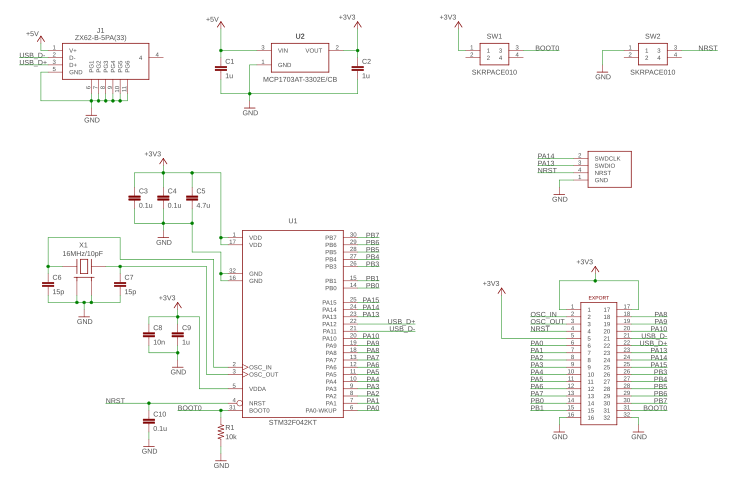

Breakout Board for STM32
===

This hardware design is published under open source lincence. You can use and modify this design freely. There is also no limitation in commercial use.

This breakout board is designed to install any QFP32 formfactor STM32 chip, and following functions are installed.

- +3.3V power supplay translated from micro USB +5V input
- 16MHz crystal to genarate accurate clock which enable to drive USB
- two buttons to reset and to specify boot mode
- 4 pin connector for debugger (SWCLK, SWDIO, NRST, and GND)
- USB data signal pins (PA11, PA12) are exported via micro USB connector, that means you can use DFU to download firmware

Please note that USB data communication function doesn't work if a STM32 MCU which has no USB functionality such as [STM32F303K8](https://www.st.com/content/st_com/en/products/microcontrollers-microprocessors/stm32-32-bit-arm-cortex-mcus/stm32-mainstream-mcus/stm32f3-series/stm32f303/stm32f303k8.html#design-scroll). 
[STM32F042K6](https://www.st.com/content/st_com/en/products/microcontrollers-microprocessors/stm32-32-bit-arm-cortex-mcus/stm32-mainstream-mcus/stm32f0-series/stm32f0x2/stm32f042k6.html) is a good candidate to use all function of this breakout board.

## PCB Design
Eagle PCB design files are placed at [here](./pcb/).

## BOM list

Components | Value / Product Number | Remarks
-----------|------------------------|------------------------------
U1         | STM32 (QFP32)          |
U2         | MCP1703AT-3302E/CB     | SOT-23A 3.3V LDO
J1         | ZX62-B-5PA(33)         | Hirose Micro USB female connector
X1         | 16MHz Crystal (3225)   | load capacitance: 10pF
C1, C2, C9 | 1uF (1005)             |
C3, C4, C10| 0.1uF (1005)           |
C5         | 4.7uF (1005)           |
C6, C7     | 15pF (1005)            | need to change value if X1's load capacitance is not 10pF
C8         | 10nF (1005)
R1         | 10k ohm (1005)         | 
